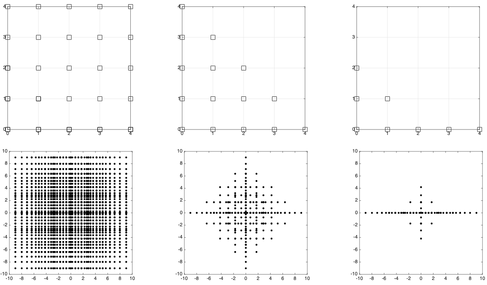

# SparseQuadrature

This MATLAB library implements sparse quadrature rule for high-dimensional integration with Gaussian measures, built based on [Sparse Grid Interpolation Toolbox](https://people.sc.fsu.edu/~jburkardt/m_src/spinterp/spinterp.html) developed by Andreas Klimke. It provides both a-priori (integrand-independent) and a-posteriori (integrand-dependent) construction algorithms to push the integration to very high dimensions (up to 10,000 dimensions tested), which were proposed and analyzed in the paper 

```
@article{chen2018sparse,
  title={Sparse quadrature for high-dimensional integration with Gaussian measure},
  author={Chen, Peng},
  journal={ESAIM: Mathematical Modelling and Numerical Analysis},
  volume={52},
  number={2},
  pages={631--657},
  year={2018},
  publisher={EDP Sciences}
}
```
Depending on the sparsity of the integrand, it can achieve dimension-independent convergence rates and faster convergence than Monte Carlo for high-dimensional integration problems. 


<p>
The admissible index sets (top) and the corresponding Genz–Keister (GK) quadrature points (bottom).Left: tensor-product grids; middle: isotropic Smolyak sparse grids; right: anisotropic sparse grids.
</p>

<br/>


<p>
Index/level in each dimension built by a-priori and a-posteriori construction algorithms using Gauss-Hermite (GH) quadrature, increasing one point (GH1) or double the number of points (GH2) in each level.
</p>

<br/>


<p>
Convergence of different quadrature rules including Gauss-Hermite (GH1 and GH2), transformed Gauss–Kronrod–Patteron (tGKP), and Genz–Keister (GK).
</p>

<br/>

<p>
Convergence of sparse quadrature with Genz–Keister (GK) rule compared with that of Monte Carlo for integrands with different sparsity.
</p>
