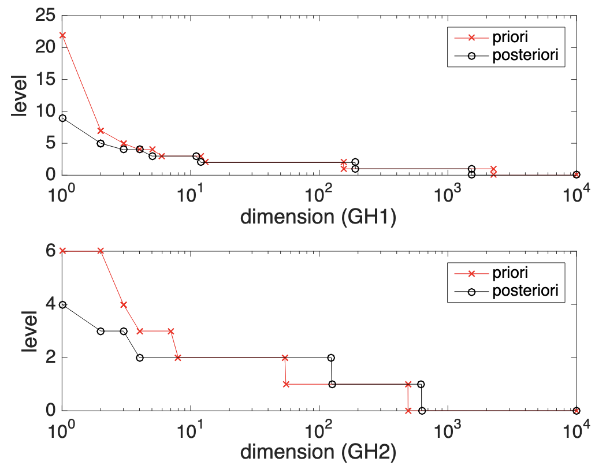
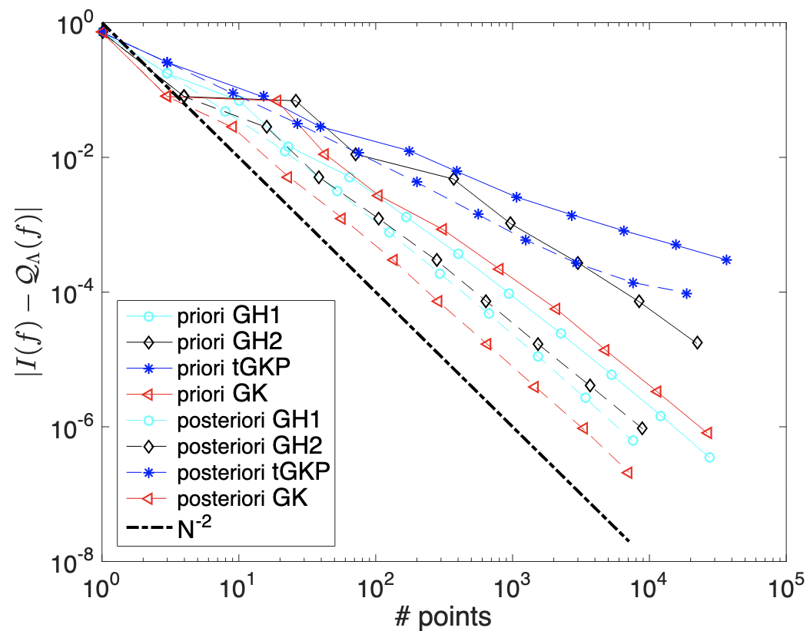
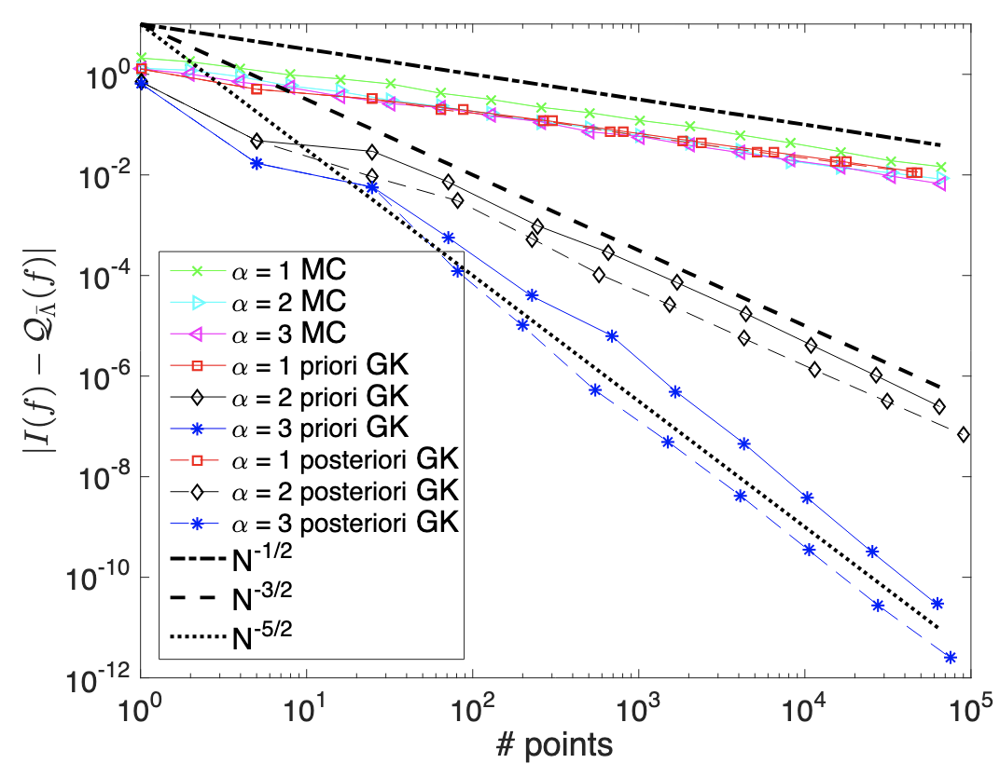

# SparseQuadrature

This library implements sparse quadrature rule for high-dimensional integration with Gaussian measures, built based on [Sparse Grid Interpolation Toolbox](https://people.sc.fsu.edu/~jburkardt/m_src/spinterp/spinterp.html) developed by Andreas Klimke, Universitaet Stuttgart. It provides both a-priori (integrand-independent) and a-posteriori (integrand-dependent) construction algorithms to push the integration to very high dimensions (up to 10,000 dimensions tested), which were proposed and analyzed in the paper 

```
@article{chen2018sparse,
  title={Sparse quadrature for high-dimensional integration with Gaussian measure},
  author={Chen, Peng},
  journal={ESAIM: Mathematical Modelling and Numerical Analysis},
  volume={52},
  number={2},
  pages={631--657},
  year={2018},
  publisher={EDP Sciences}
}
```

It achieved dimension-independent convergence rates and faster convergence than Monte Carlo for high-dimensional integration problems as shown below 



